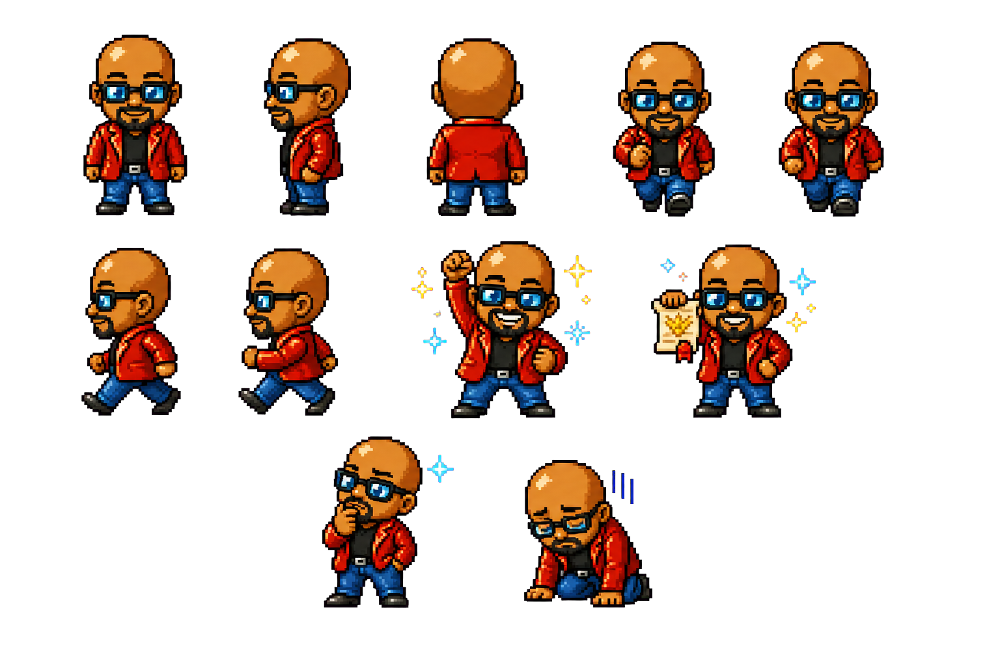

# LifeQuest OS

LifeQuest OS is a **Next.js + React personal operating system** prototype with a JRPG-inspired UI, local-first data storage, daily planning loops, and AI-assisted workflows.

## Features

- Dashboard command center for today’s quests and momentum tracking.
- Task (Quest Log) CRUD flow.
- Morning standup and evening postmortem workflows.
- Metrics, journal capture, and daily markdown report export.
- AI coach and voice session foundations.
- PWA install + offline shell support.

## Tech Stack

- Next.js App Router
- React 19
- TypeScript
- Vitest + Playwright

## Project Structure

- `src/app` — routed pages and API routes
- `src/components` — reusable UI components
- `src/domain` — domain types and core logic
- `src/data` — local repository modules
- `tests` and `e2e` — unit/component and end-to-end coverage

## Screenshots

> Note: In this execution environment, browser binaries were unavailable for automated page captures, so these screenshots use bundled project art assets.

### Character + Theme Assets




### Navigation Icon Set


## Getting Started

```bash
npm install
npm run dev
```

App runs at `http://127.0.0.1:3000`.

## Useful Scripts

```bash
npm run lint
npm run typecheck
npm run test
npm run test:e2e
```

## Notes

- Demo mode guidance is available in `PORTFOLIO_DEMO_README.md`.
- Health/AI features are supportive workflow tools and not medical advice.
